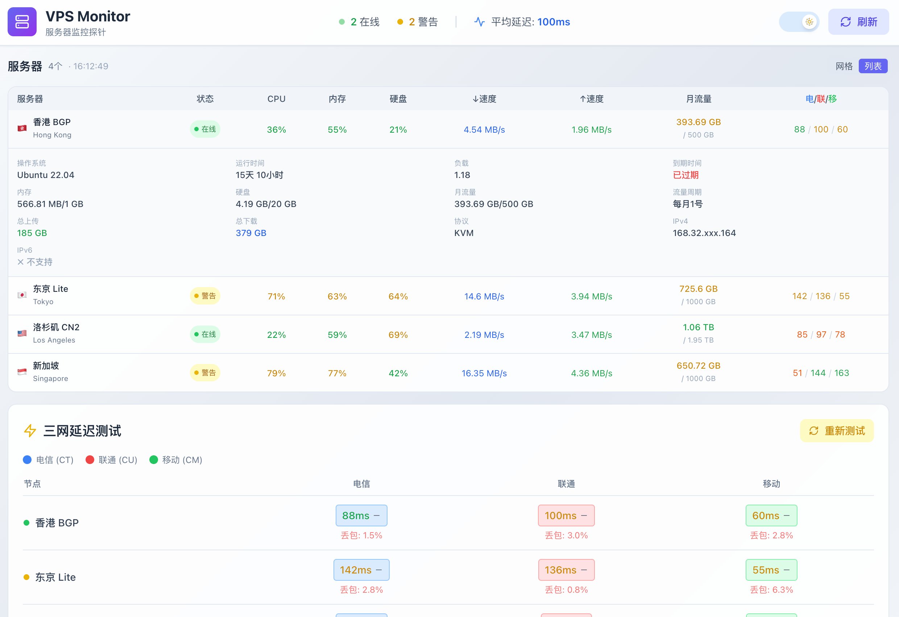

# VPS Monitor - 轻量级服务器监控探针

一个轻量级的 VPS 监控探针系统，支持一键部署到 Vercel。基于 Vercel Serverless + Redis 存储，无需独立后端服务。




## 🎯 特性亮点

- ⚡ **一键部署** - 部署到 Vercel，无需服务器
- 🌍 **IP 自动定位** - 自动识别 VPS 所在地区和运营商
- 🔐 **Token 认证** - 安全的数据上报机制
- 📱 **响应式设计** - 完美适配桌面端和移动端
- 🌓 **暗色模式** - 支持明暗主题切换
- 🔄 **实时监控** - 2 秒自动刷新数据（可配置）
- 🔔 **智能隐藏** - 离线超 1 分钟的节点自动隐藏，上线后自动显示

## ✨ 功能特性

### 服务器监控
- 🖥️ **节点名称** - 支持自定义或自动识别（城市 + ISP）
- 🌍 **位置显示** - 国旗 emoji 直观展示，IP 自动定位
- ⏱️ **开机时间** - 显示服务器运行时长
- 🔌 **协议类型** - 支持 KVM/OpenVZ 等虚拟化类型
- 📊 **系统负载** - 1/5/15 分钟负载监控
- 🐧 **操作系统** - 自动识别发行版（Debian/Ubuntu/CentOS 等）

### 资源监控
- 💻 **CPU 使用率** - 实时处理器占用情况
- 🧠 **内存使用** - 内存使用量及百分比
- 💾 **硬盘使用** - 磁盘空间使用情况
- 🌐 **IPv6 支持** - 自动检测 IPv6 连接状态

### 网络流量
- 📈 **实时速度** - 当前下载/上传速度
- 📅 **月流量** - 月度流量使用统计（支持自定义重置日）
- 📊 **剩余流量** - 实时显示本月剩余流量
- 🔄 **流量周期** - 每个 VPS 可配置不同的流量重置日和配额

### 网络质量
- 📶 **三网延迟** - 电信/联通/移动延迟测试
- 📉 **丢包率** - 网络丢包情况监控
- 🎯 **连接质量** - 优秀/良好/较差状态指示

## 🚀 快速开始

### 方式一：一键部署到 Vercel（推荐）

1. **Fork 本仓库**

2. **在 Vercel 导入项目**
   - 登录 [Vercel](https://vercel.com)
   - 点击 "Add New Project"
   - 导入你 Fork 的仓库

3. **配置 Redis 存储（通过 Vercel Marketplace）**
   - 在 Vercel Dashboard → 你的项目 → **Storage** 标签
   - 点击 **Create Database** 或 **Browse Marketplace**
   - 选择 **Upstash for Redis** 或 **Redis**
   - 创建并连接到你的项目
   - 环境变量 `REDIS_URL` 会自动注入

4. **配置环境变量**
   ```
   API_TOKEN=your-secret-token-here
   ```

5. **重新部署，完成！**

[](https://vercel.com/new/clone?repository-url=https://github.com/Zbun/avpsmonitor)

### 方式二：本地开发

```bash
# 安装依赖
npm install

# 开发模式（使用 Demo 数据）
npm run dev

# 构建生产版本
npm run build
```

访问 http://localhost:3000 查看效果。

## 📡 安装 Agent

在你的 VPS 上运行以下命令安装监控 Agent：

### 一键安装（推荐）

```bash
curl -fsSL https://raw.githubusercontent.com/Zbun/avpsmonitor/main/agent/install.sh | bash -s -- \
  https://your-app.vercel.app \
  your-api-token \
  my-vps-01
```

只需 3 个参数：
| 参数 | 说明 | 示例 |
|------|------|------|
| `SERVER_URL` | Vercel 部署地址 | `https://vps.vercel.app` |
| `API_TOKEN` | API 认证 Token | `your-secret-token` |
| `NODE_ID` | 节点唯一标识 | `hk-01` |

> 💡 **位置自动识别**：服务端会根据 VPS 的 IP 地址自动识别地区和运营商，无需手动配置！

### 手动安装

```bash
# 下载 Agent
curl -fsSL https://raw.githubusercontent.com/Zbun/avpsmonitor/main/agent/agent.js -o /opt/vps-agent/agent.js

# 编辑配置
export SERVER_URL="https://your-app.vercel.app"
export API_TOKEN="your-api-token"
export NODE_ID="my-vps-01"

# 运行
node /opt/vps-agent/agent.js
```

### Agent 管理

```bash
# 查看状态
systemctl status vps-agent

# 查看日志
journalctl -u vps-agent -f

# 重启服务
systemctl restart vps-agent

# 卸载
systemctl stop vps-agent
systemctl disable vps-agent
rm -rf /opt/vps-agent /etc/systemd/system/vps-agent.service
```

## 🏗️ 架构说明

```
┌─────────────┐         ┌──────────────────────────────────┐
│   VPS 1     │         │          Vercel                  │
│ ┌─────────┐ │  POST   │  ┌────────────┐    ┌──────────┐  │
│ │  Agent  │─┼────────►│  │ /api/report│───►│  Redis   │  │
│ └─────────┘ │         │  │  (上报API) │    │(Upstash) │  │
├─────────────┤         │  └────────────┘    └────┬─────┘  │
│   VPS 2     │         │                         │        │
│ ┌─────────┐ │         │  ┌────────────┐         │        │
│ │  Agent  │─┼────────►│  │ /api/nodes │◄────────┘        │
│ └─────────┘ │         │  │  (查询API) │                  │
├─────────────┤         │  └─────┬──────┘                  │
│   VPS N     │         │        │                         │
│ ┌─────────┐ │         │  ┌─────▼──────┐                  │
│ │  Agent  │─┼────────►│  │   React    │  ◄── 用户访问    │
│ └─────────┘ │         │  │   前端     │                  │
└─────────────┘         │  └────────────┘                  │
                        └──────────────────────────────────┘
```

### 数据流程

1. **Agent 上报** → VPS 上的 Agent 每 4 秒向 `/api/report` 发送系统数据
2. **IP 定位** → 服务端自动根据 IP 获取地理位置（使用 ip-api.com）
3. **月流量统计** → 服务端记录每个计费周期的基准流量，自动计算月用量
4. **数据存储** → 数据存入 Redis，设置 20 秒过期（约 15 秒无上报判定为离线）
5. **离线隐藏** → 节点离线超过 1 分钟自动从面板隐藏，上线后自动恢复显示
6. **前端展示** → 前端定时从 `/api/nodes` 获取最新数据（可通过 `REFRESH_INTERVAL` 配置）

## ⚙️ 环境变量

### Vercel 环境变量

| 变量名 | 必填 | 说明 | 默认值 |
|--------|------|------|--------|
| `API_TOKEN` | ✅ | Agent 认证 Token | - |
| `VPS_SERVERS` | ❌ | 预配置服务器列表 | 见下方说明 |
| `REFRESH_INTERVAL` | ❌ | 前端数据刷新间隔（毫秒） | `2000` |
| `REDIS_URL` | 🔄 | Redis 连接地址（Marketplace 自动配置） | - |

> 🔄 表示连接 Vercel Marketplace 的 Redis 后自动配置，无需手动设置

### VPS_SERVERS 服务器列表配置

通过 `VPS_SERVERS` 环境变量可以预先配置服务器的显示名称、国家代码、位置、**到期时间**、**流量重置日**和**月流量总数**，**优先级高于 IP 自动识别和 Agent 上报**。

**格式**：`节点ID:显示名称:国家代码:位置:到期日期:流量重置日:月流量总数`，多个服务器用逗号分隔

**示例**：
```
VPS_SERVERS=hk-01:香港 CN2 GIA:HK:Hong Kong:2025-12-31:1:1t,jp-01:东京 Lite:JP:Tokyo:2025-06-15:15:3TB,us-01:洛杉矶 9929:US:Los Angeles:2026-01-01:8:500g
```

**字段说明**：
| 字段 | 说明 | 示例 | 是否必填 |
|------|------|------|----------|
| 节点ID | 与 Agent 配置的 NODE_ID 一致 | `hk-01` | ✅ |
| 显示名称 | 前端显示的服务器名称 | `香港 CN2 GIA` | ✅ |
| 国家代码 | ISO 3166-1 alpha-2 代码 | `HK` | ❌ (默认 US) |
| 位置描述 | 位置信息 | `Hong Kong` | ❌ |
| 到期日期 | VPS 到期时间，格式 YYYY-MM-DD | `2025-12-31` | ❌ |
| 流量重置日 | 每月几号重置流量统计 (1-28) | `1` | ❌ (默认 1) |
| 月流量总数 | 每月流量配额，支持 `1T`、`3TB`、`512G`、`500GB`、`1024` 写法，不区分大小写，无单位默认 GB | `1t` | ❌ (默认 1TB) |

> 💡 **提示**：
> - 如果不配置 `VPS_SERVERS`，系统会根据 VPS 的 IP 地址自动识别位置信息
> - 到期日期、流量重置日、月流量总数可以为空，系统会使用 Agent 上报的值或默认值
> - 每个 VPS 的流量重置日和月流量配额可以不同，对应各商家的计费周期

### Agent 环境变量

| 变量名 | 必填 | 说明 |
|--------|------|------|
| `SERVER_URL` | ✅ | Vercel 部署地址 |
| `API_TOKEN` | ✅ | API 认证 Token |
| `NODE_ID` | ✅ | 节点唯一标识 |
| `NODE_NAME` | ❌ | 自定义名称（默认自动识别） |
| `COUNTRY_CODE` | ❌ | 国家代码（默认自动识别） |
| `LOCATION` | ❌ | 位置描述（默认自动识别） |
| `EXPIRE_DATE` | ❌ | 到期时间，格式 YYYY-MM-DD |
| `TRAFFIC_RESET_DAY` | ❌ | 流量重置日 (1-28)，默认 1 |

> 💡 **推荐**：到期时间和流量重置日建议在 `VPS_SERVERS` 环境变量中统一配置，便于管理。

## 🛠️ 技术栈

- **React 18** - UI 框架
- **TypeScript 5** - 类型安全
- **Vite 5** - 构建工具
- **Tailwind CSS 3** - 样式框架
- **Lucide React** - 图标库
- **ioredis** - Redis 客户端
- **Vercel Serverless** - 无服务器函数
- **Vercel Marketplace Redis** - 数据存储

## 📁 项目结构

```
avpsmonitor/
├── api/                  # Vercel Serverless 函数
│   ├── nodes.ts          # GET  /api/nodes - 获取所有节点
│   └── report.ts         # POST /api/report - Agent 数据上报
├── agent/                # VPS 监控 Agent
│   ├── agent.js          # Agent 脚本（纯 Node.js，零依赖）
│   ├── install.sh        # 一键安装脚本
│   └── README.md         # Agent 文档
├── src/
│   ├── components/       # React 组件
│   │   ├── Header.tsx    # 顶部导航
│   │   ├── Footer.tsx    # 页脚
│   │   ├── VPSCard.tsx   # 节点卡片（卡片视图）
│   │   ├── VPSTable.tsx  # 节点表格（列表视图）
│   │   └── ...
│   ├── data/             # Demo 数据
│   ├── hooks/            # 自定义 Hooks
│   ├── types/            # TypeScript 类型定义
│   ├── App.tsx           # 主应用
│   └── main.tsx          # 入口文件
├── vercel.json           # Vercel 路由配置
├── .env.example          # 环境变量示例
└── package.json
```

## 🌍 支持的国家/地区

系统会自动识别以下国家/地区并显示对应国旗：

| 代码 | 国家/地区 | 代码 | 国家/地区 |
|------|-----------|------|-----------|
| 🇨🇳 CN | 中国 | 🇺🇸 US | 美国 |
| 🇭🇰 HK | 香港 | 🇯🇵 JP | 日本 |
| 🇹🇼 TW | 台湾 | 🇰🇷 KR | 韩国 |
| 🇸🇬 SG | 新加坡 | 🇩🇪 DE | 德国 |
| 🇬🇧 GB | 英国 | 🇫🇷 FR | 法国 |
| 🇳🇱 NL | 荷兰 | 🇷🇺 RU | 俄罗斯 |
| 🇦🇺 AU | 澳大利亚 | 🇨🇦 CA | 加拿大 |

> 更多国家代码遵循 [ISO 3166-1 alpha-2](https://en.wikipedia.org/wiki/ISO_3166-1_alpha-2) 标准

## 📝 License

MIT License

## 🤝 贡献

欢迎提交 Issue 和 Pull Request！

## 📮 问题反馈

如有问题或建议，请在 [GitHub Issues](https://github.com/Zbun/avpsmonitor/issues) 提交。

---

Made with ❤️ | Powered by Vercel + Redis
